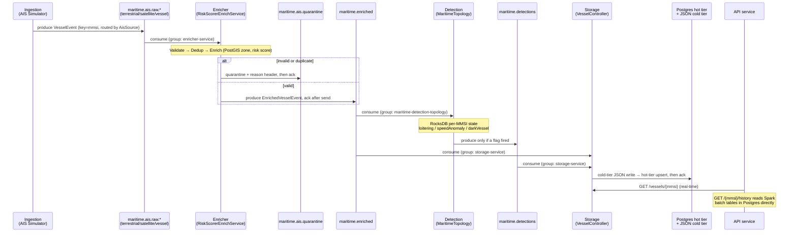

<div align="center">


<br/>

[](https://openjdk.org/projects/jdk/17/)
[](https://spring.io/projects/spring-boot)
[](https://kafka.apache.org/)
[](https://spark.apache.org/)
[](https://postgis.net/)
[](https://react.dev/)
[](https://www.docker.com/)
[](https://grafana.com/)
[](https://avro.apache.org/)

<br/>

[](https://maven.apache.org/)
[](https://openjdk.org/)
[](.)
[](.)
[](.)

</div>

---

> **What this is:** A backend work sample simulating a production maritime intelligence platform — end-to-end Kafka pipeline, stateful Kafka Streams detection, Lambda architecture with Spark, PostGIS geospatial enrichment, and a live React map. Runs entirely on localhost with no cloud dependency.

---

## 📑 Table of Contents

- [🎯 What This Project Focuses On](#-what-this-project-focuses-on)
- [🏗️ Architecture Overview](#%EF%B8%8F-architecture-overview)
- [📦 Modules](#-modules)
- [🚢 The Nine-Vessel Fleet](#-the-nine-vessel-fleet)
- [🌊 Event Flow — The Life of a Vessel Event](#-event-flow--the-life-of-a-vessel-event)
- [✅ Implemented Features](#-implemented-features)
- [⚙️ Key Engineering Decisions](#%EF%B8%8F-key-engineering-decisions)
- [🔀 Plain Kafka vs. Kafka Streams](#-plain-kafka-vs-kafka-streams)
- [🚀 How to Run](#-how-to-run)
- [🔑 Key Concepts Demonstrated](#-key-concepts-demonstrated)

---

## 🎯 What This Project Focuses On

This is a **backend work sample**, not a tutorial. Its focus is showing *how* a production maritime data pipeline is engineered, with the rationale behind each choice.

| Pillar | What's demonstrated |
|:---|:---|
| 📡 **Real-time streaming** | End-to-end Kafka pipeline (ingest → enrich → detect → store → serve) with explicit topics, consumer groups, and partitioning by vessel |
| 🧠 **Stateful processing** | Per-vessel behavioural detection (loitering, speed anomaly, dark vessel) on fault-tolerant Kafka Streams state — in its own service, distinct from the stateless ETL path |
| 🛡️ **Data integrity** | Schema-on-write with Avro + Schema Registry, validation with a quarantine path, consumer-side deduplication, and at-least-once delivery with dead-letter handling |
| 🗺️ **Maritime domain** | Geospatial enrichment against real PostGIS geofences (RESTRICTED / PORT / EEZ zones), risk scoring, and AIS-specific signals |
| ⚡ **Lambda architecture** | Real-time *speed layer* (Kafka Streams) + exact *batch layer* (Spark over a JSON cold tier), merged behind one *serving layer* |
| 💾 **Tiered storage** | Postgres hot tier for low-latency queries + partitioned JSON cold tier for batch analytics, decoupled behind swappable ports |
| 🔭 **Operability** | Micrometer + Prometheus + Grafana, correlation-ID tracing across async hops, structured logging, CI |
| 📝 **Design rationale** | Every significant decision is documented with the *why*, not just the *what* |

> **Non-goals:** This is a localhost learning/portfolio build — it does **not** target cloud deployment, authentication/authorization, horizontal-scale tuning, or a production AIS feed. Those are deliberately out of scope so the focus stays on the data-pipeline engineering above.

---

## 🏗️ Architecture Overview

```
┌─────────────────────────────────────────────────────────────────────────────┐
│                          LAMBDA ARCHITECTURE                                │
│                                                                             │
│   ┌──────────────┐   raw topics   ┌──────────────┐   maritime.enriched     │
│   │  Ingestion   │ ─────────────► │   Enricher   │ ──────────┬─────────►   │
│   │  :8081       │  (3 sources)   │   :8082      │           │             │
│   └──────────────┘                └──────────────┘           │             │
│                                                              ▼             │
│                                                    ┌──────────────┐        │
│   ╔══ SPEED LAYER ═══════════════════════════════► │  Detection   │        │
│   ║                                                │  :8086       │        │
│   ║   Kafka Streams · RocksDB · loitering          └──────┬───────┘        │
│   ║   speed anomaly · dark vessel                         │                │
│   ╚════════════════════════════════════════════════       │ maritime.       │
│                                                           │ detections      │
│                                                           ▼                │
│   ╔══ BATCH LAYER ════════════════════════════════ ┌──────────────┐        │
│   ║                                                │   Storage    │        │
│   ║   Spark Jobs · DailyAggregates                 │   :8083      │        │
│   ║   RiskRollup · LoiteringHotspot                └──────┬───────┘        │
│   ╚════════════════════════════════════════════════       │                │
│                                                           ▼                │
│   ╔══ SERVING LAYER ══════════════════════════════ ┌──────────────┐        │
│   ║                                                │  API Service │        │
│   ║   Merges speed-layer + batch-layer views        │  :8084       │        │
│   ╚════════════════════════════════════════════════ └──────┬───────┘        │
│                                                           │                │
│                                                           ▼                │
│                                                  ┌──────────────────┐      │
│                                                  │  React Frontend  │      │
│                                                  │  :5173 (nginx)   │      │
│                                                  └──────────────────┘      │
└─────────────────────────────────────────────────────────────────────────────┘
```

The platform follows a **Lambda architecture**: a real-time *speed layer* (Kafka Streams stateful detection), an exact *batch layer* (Spark jobs computing daily aggregates and risk percentiles), and a *serving layer* (the API service merging both views).

---

## 📦 Modules

The project is a Maven multi-module build with **seven modules** — five runnable Spring Boot services, one shared library, and one standalone Spark application — plus a React frontend.

| Module | Type | Port | Responsibility |
|:---|:---|:---:|:---|
| `maritime-common` | 📚 Shared library | — | Avro DTOs, Topics constants, GeoUtils, observability plumbing |
| `maritime-ingestion` | 🟢 Spring Boot | **8081** | AIS simulator — nine-vessel fleet with smooth waypoint interpolation |
| `maritime-enricher` | 🟢 Spring Boot | **8082** | Stateless ETL: validate → dedup → PostGIS enrich → risk score |
| `maritime-detection` | 🟢 Spring Boot | **8086** | Stateful Kafka Streams topology: loitering, speed anomaly, dark vessel |
| `maritime-storage` | 🟢 Spring Boot | **8083** | Tiered persistence (Postgres hot + JSON cold) + query API |
| `maritime-api` | 🟢 Spring Boot | **8084** | Public-facing serving layer — merges speed-layer and batch-layer views |
| `maritime-spark` | ⚡ Standalone Spark | — | Batch analytics over the cold JSON tier |
| `maritime-frontend` | ⚛️ React + Vite SPA | **5173** | Live nautical map, vessel trails, detail panel, 90-day history chart |

<details>
<summary><b>📚 maritime-common — shared library</b></summary>

The single dependency every module pulls in. Holds the **Avro-generated DTOs** (`VesselEvent`, `EnrichedVesselEvent`) so all services share one schema; **`Topics` constants** (single source of truth for every Kafka topic name); **validation** (`VesselEventValidator`); **geospatial math** (`GeoUtils` — Haversine + JTS point-in-polygon); and **observability plumbing** (`CorrelationIds`, HTTP filter / Kafka interceptors). Has no `main` — it is a JAR, not a service.

</details>

<details>
<summary><b>📡 maritime-ingestion (8081) — event source</b></summary>

The start of the pipeline. The vessel fleet is defined entirely in `SimulatedVessel`, an enum where each constant holds the vessel's MMSI, display label, speed, waypoint track, and **AIS source type** (`TERRESTRIAL`, `SATELLITE`, or `VESSEL`). `AisSimulatorController` iterates `SimulatedVessel.values()` every 2 seconds and routes each vessel's events to the corresponding raw topic (`maritime.ais.raw.terrestrial`, `.satellite`, or `.vessel`) based on its `AisSource`. Adding a vessel requires only a new enum constant.

Waypoint vessels are linearly interpolated between waypoints over `ticksPerWaypoint` ticks, producing smooth continuous movement. Heading is computed as the true bearing to the next waypoint, so markers rotate naturally on turns. Exposes `POST /api/v1/simulate/start|stop`.

</details>

<details>
<summary><b>🔄 maritime-enricher (8082) — stateless ETL</b></summary>

Purely stateless — no Kafka Streams, no RocksDB. `RiskScorerEnrichService` (`@KafkaListener` + `KafkaTemplate`) consumes all three raw source topics (`maritime.ais.raw.terrestrial`, `.satellite`, `.vessel`) under a single consumer group and merges them into a unified ETL pipeline: validate → dedup → PostGIS zone enrichment → risk score → publish to `maritime.enriched`. Bad/duplicate events go to `maritime.ais.quarantine` with a `reason` header. Also owns the shared database's Flyway migrations (zones catalog + Spark output tables). Uses `spring.flyway.baseline-on-migrate=true` so it can run against a database that was pre-seeded without Flyway.

</details>

<details>
<summary><b>🔍 maritime-detection (8086) — stateful detection</b></summary>

The Kafka Streams service. `MaritimeTopology` consumes `maritime.enriched` under the dedicated consumer group `maritime-detection-topology` and maintains per-MMSI state in a RocksDB-backed store, fault-tolerant via its changelog topic. `VesselDetectionProcessor` runs three detectors:

- 🔴 **Loitering** — sustained low-speed dwell
- 🟠 **Speed anomaly** — Haversine-implied speed vs. reported SOG divergence
- ⬛ **Dark vessel** — wall-clock punctuator scanning for AIS reporting gaps

Flagged events are published to `maritime.detections`. No Postgres dependency — all state is in RocksDB. `DetectionTopicConfig` owns the `maritime.detections` topic declaration and the Streams changelog topics.

</details>

<details>
<summary><b>💾 maritime-storage (8083) — persistence + query</b></summary>

Consumes `maritime.enriched` **and** `maritime.detections`. Writes each event to:

- **Hot tier** (`PostgresVesselStateHotStore`) — `INSERT … ON CONFLICT (mmsi) DO UPDATE` upsert into `vessel_risk`. The flat columns (`risk_level`, `loitering`, …) are queryable; a canonical Avro-JSON `payload` column makes the GET endpoint a byte-for-byte round-trip.
- **Cold tier** (`FileSystemJsonColdTier`) — one JSON file per event under a Hive-style partition layout: `vessel-events/date=<yyyy-MM-dd>/mmsi=<mmsi>/<epochMs>.json`. Spark reads this with `spark.read().format("json")` and discovers `date` / `mmsi` as virtual partition columns, so no metastore is needed.

Both tiers sit behind `VesselStateHotStore` / `ColdTierWriter` ports, so the backing store is swappable. Serves `GET /api/v1/vessels/{mmsi}` (returns 404 when no data exists, never 500).

</details>

<details>
<summary><b>🌐 maritime-api (8084) — serving layer</b></summary>

The public API. Proxies real-time state from the storage service (`GET /api/v1/intelligence/{mmsi}`) and reads the Spark batch tables in Postgres directly for history (`/{mmsi}/history`). `RestTemplate` calls to the storage service are wrapped in a `HttpClientErrorException.NotFound` catch so a vessel with no data yet returns 404 rather than propagating a 500. It is the Lambda-architecture *serving layer* that merges the speed-layer and batch-layer views behind one contract.

</details>

<details>
<summary><b>⚡ maritime-spark — batch layer</b></summary>

A standalone Spark application (not a Spring service), deliberately isolated so its heavy dependency tree never collides with the services' classpaths. Three jobs read the cold JSON tier and write rollups to Postgres, run via `spark-submit` or `mvn exec:java -Plocal`:

| Job | Output table | What it computes |
|:---|:---|:---|
| `DailyVesselAggregatesJob` | `vessel_daily_stats` | Per-vessel daily event counts, avg/max speed, avg risk, detection-flag counts |
| `RiskRollupJob` | `vessel_risk_percentiles` | p50/p95 risk percentiles per vessel per day |
| `LoiteringHotspotJob` | `loitering_hotspots` | Top-N loitering grid cells (PostGIS GiST-indexed) |

</details>

<details>
<summary><b>⚛️ maritime-frontend — live nautical map</b></summary>

A React 18 + Vite 5 SPA. In production it is built into a static bundle and served by nginx inside a Docker container. In development it runs on the Vite dev server with a built-in proxy.

**Tech stack:** react-leaflet 4 + leaflet 1.9 · TanStack Query v5 · Recharts 2 · Tailwind CSS v4

**How it works:**

1. **Polling** — `useFleet.js` issues `GET /api/v1/intelligence/{mmsi}` for each vessel every 2 seconds using `useQueries`. `retry: false` prevents hammering the API when the dark vessel returns 404 after going silent.
2. **Trajectory trails** — position history accumulated in a `useRef` map (no re-render on every append), capped at 60 points ≈ 2 minutes of history. Rendered as `<Polyline>` beneath the markers; selected vessel trail is thicker and more opaque; dark vessels get a dashed trail.
3. **Marker colours** — risk-coded: 🟢 LOW / 🟠 MEDIUM / 🔴 HIGH. Dark vessels override this with near-black `#111827` regardless of risk level.
4. **Detail panel** — MMSI, risk badge, detection flags, speed, zone, distance to port, and a Recharts `ComposedChart` showing daily event count (bar) and avg/p95 risk scores (lines) for up to 90 days.
5. **Simulator controls** — **Start** / **Stop** buttons call `POST /api/v1/simulate/start|stop`. A pulsing green dot appears while the simulation is running.

**Proxy configuration:**

| Path | Dev (Vite) | Production (nginx) |
|:---|:---|:---|
| `/api/v1/simulate/*` | → `localhost:8081` | → `host.docker.internal:8081` |
| `/api/v1/*` | → `localhost:8084` | → `host.docker.internal:8084` |

</details>

---

## 🚢 The Nine-Vessel Fleet

Each vessel is one constant in the `SimulatedVessel` enum, carrying its MMSI, display label, speed, waypoint track, and AIS source type.

| MMSI | Label | Behaviour | Detector target | AIS Source |
|:---:|:---|:---|:---:|:---:|
| `123456789` | 🟢 Normal Transit | Steady eastbound track across the Gulf | — | Terrestrial |
| `234567890` | 🔴 Loiterer | Smooth circular drift at 0.3 kn | **Loitering** | Satellite |
| `345678901` | ⬛ Dark Vessel | Transits, then goes silent after 12 reports | **Dark vessel** | Vessel |
| `456789012` | 🟠 Speed Anomaly | Reports 2 kn but jumps ~24 nm per tick | **Speed anomaly** | Terrestrial |
| `111111111` | 🚢 Tanker Alpha | Southbound Texas → Yucatan | — | Satellite |
| `222222222` | 🚢 Tanker Bravo | Westbound Florida → Texas | — | Terrestrial |
| `333333333` | 📦 Cargo Alpha | Northbound Cuba → New Orleans | — | Vessel |
| `444444444` | 📦 Cargo Bravo | Deep-gulf east-to-west transit | — | Satellite |
| `555555555` | 🎣 Fishing Vessel | Slow meander near Louisiana coast | — | Terrestrial |

> Waypoint vessels are linearly interpolated between positions. The loiterer uses a deterministic sin/cos circular drift — visually smooth and reproducible, unlike `Math.random()`. Heading is computed as the true bearing to the next waypoint, so markers rotate naturally on turns.

---

## 🌊 Event Flow — The Life of a Vessel Event

A single AIS report travels through five services and up to four Kafka topics. Every Kafka payload is Avro, keyed by `mmsi` (so a vessel's events stay ordered on one partition). Each consumer commits its offset **only after** its side effect succeeds (ack-after-side-effect, at-least-once).

### Topics & Consumer Groups

| Topic | Produced by | Consumed by (group) | Payload |
|:---|:---|:---|:---|
| `maritime.ais.raw.terrestrial` | Ingestion | Enricher (`enricher-service`) | `VesselEvent` (sourceType=TERRESTRIAL) |
| `maritime.ais.raw.satellite` | Ingestion | Enricher (`enricher-service`) | `VesselEvent` (sourceType=SATELLITE) |
| `maritime.ais.raw.vessel` | Ingestion | Enricher (`enricher-service`) | `VesselEvent` (sourceType=VESSEL) |
| `maritime.enriched` | Enricher | Detection (`maritime-detection-topology`) **+** Storage (`storage-service`) | `EnrichedVesselEvent` |
| `maritime.detections` | Detection | Storage (`storage-service`) | `EnrichedVesselEvent` (≥1 flag set) |
| `maritime.ais.quarantine` | Enricher | *(audit sink)* | `VesselEvent` + `reason` header |
| `maritime.ais.raw.*.DLT` / `maritime.enriched.DLT` | `DefaultErrorHandler` after retries exhausted | *(dead-letter sink)* | original record |

> **Two independent consumers of `maritime.enriched`.** The detection service and the storage service each subscribe under their own consumer groups. The detection topology re-publishes only *flagged* events to the separate `maritime.detections` topic — it never writes back to `maritime.enriched`, keeping the flow a strict DAG with no feedback loops.

### Sequence Diagram



### Step by Step

1. **Ingest** — the simulator emits a `VesselEvent` keyed by MMSI, routed to one of three raw topics based on each vessel's `AisSource`. A correlation ID is stamped into the MDC and Kafka headers.
2. **Validate & dedup** — `RiskScorerEnrichService` validates the event and checks the Caffeine dedup cache. Invalid or duplicate events go to `maritime.ais.quarantine`; offset is acked only after the quarantine send confirms.
3. **Enrich & score** — valid events get a PostGIS zone lookup and a risk score, are wrapped as `EnrichedVesselEvent` (detection flags default `false`), and published to `maritime.enriched`. Offset acked only after the produce callback succeeds.
4. **Detect (speed layer)** — `MaritimeTopology` in `maritime-detection` consumes `maritime.enriched`, updates per-MMSI RocksDB state, and runs the loitering / speed-anomaly / dark-vessel detectors. Events where a flag fires are re-published to `maritime.detections`; clean events produce no output.
5. **Persist** — `VesselController` subscribes to **both** `maritime.enriched` and `maritime.detections`. Each event is written to the JSON cold tier and upserted into the Postgres hot tier, then acked.
6. **Serve** — the API service exposes `GET /api/v1/intelligence/{mmsi}` (real-time, proxied from the storage hot tier) and `/{mmsi}/history` (Spark batch rollups read straight from Postgres).
7. **Failure path** — if a consumer throws, `DefaultErrorHandler` retries (fixed backoff, 3 attempts); exhausted records land in `<topic>.DLT` instead of blocking the partition.

---

## ✅ Implemented Features

<details>
<summary><b>📡 Ingestion & simulation</b></summary>

- **AIS simulator** (`AisSimulatorController` + `SimulatedVessel`) drives a nine-vessel demo fleet on a 2-second scheduler. Each vessel carries an `AisSource` that determines its raw ingestion topic. The `sourceType` field is stamped on every `VesselEvent` and flows through the full pipeline. Adding a vessel is one enum constant.
- Waypoint vessels are smoothly interpolated between positions; heading is the true bearing to the next waypoint.
- Loiterer uses a deterministic sin/cos circular drift — visually smooth and reproducible.
- Start/stop via `POST /api/v1/simulate/start` and `/stop`.

</details>

<details>
<summary><b>🔄 Enrichment & risk scoring</b></summary>

- **ETL pipeline** (`RiskScorerEnrichService`): Validate → Dedup → Enrich → Score, consuming all three raw source topics and producing `maritime.enriched`.
- **Validation** (`VesselEventValidator`): MMSI format (9 digits), lat/lon bounds, null-island `(0,0)` rejection, timestamp staleness, and a speed ceiling. Bad records are routed to `maritime.ais.quarantine` with a reason header.
- **Deduplication** (`DedupService`): Caffeine-backed, keyed on `(mmsi, timestamp)` with TTL expiry — the consumer-side idempotency that at-least-once delivery requires.
- **Geospatial enrichment** (`ZoneRepository`): PostGIS `ST_Contains` lookup against a zones catalog (RESTRICTED / PORT / EEZ) with a GiST index.
- **Risk scoring**: Additive model over zone type, near-port proximity, and speed, mapped to LOW / MEDIUM / HIGH.

</details>

<details>
<summary><b>🔍 Stateful behavioural detection — speed layer</b></summary>

- **Kafka Streams topology** (`MaritimeTopology`) with per-MMSI state in a RocksDB-backed store (fault-tolerant via changelog), running in its own Spring Boot service. Three detectors in `VesselDetectionProcessor`:
  - *Loitering* — sustained low-speed dwell
  - *Speed anomaly* — Haversine-implied speed vs. reported SOG divergence
  - *Dark vessel* — wall-clock punctuator scanning for reporting gaps (silence)
- Detections are emitted to a dedicated `maritime.detections` topic (never fed back into the input), keeping the data flow a strict DAG.

</details>

<details>
<summary><b>💾 Tiered storage</b></summary>

- **Hot tier** (`PostgresVesselStateHotStore`): latest state per vessel, `INSERT … ON CONFLICT (mmsi) DO UPDATE` upsert, with a canonical Avro-JSON `payload` column plus flat queryable columns.
- **Cold tier** (`FileSystemJsonColdTier`): one JSON file per event under a Hive-style `date=/mmsi=` partition layout. Spark reads it with `format("json")` and discovers partition columns automatically — no Hadoop or AWS SDK dependency in the Spring Boot process.
- Both tiers sit behind `VesselStateHotStore` / `ColdTierWriter` ports, so the backing store is swappable. The storage service consumes both `maritime.enriched` and `maritime.detections`, acking only after both tier writes succeed.

</details>

<details>
<summary><b>⚡ Batch analytics — batch layer</b></summary>

- **`DailyVesselAggregatesJob`**: per-vessel daily event counts, avg/max speed, avg risk, and detection-flag counts → `vessel_daily_stats`.
- **`RiskRollupJob`**: p50/p95 risk percentiles per vessel per day → `vessel_risk_percentiles`.
- **`LoiteringHotspotJob`**: top-N loitering grid cells → `loitering_hotspots` (PostGIS GiST-indexed).
- Jobs read the cold JSON tier via a shared `SparkSessionFactory` / `JobConfig`, writing idempotently to PostGIS.

</details>

<details>
<summary><b>🌐 Serving layer</b></summary>

- `GET /api/v1/intelligence/{mmsi}` — latest real-time enriched state (speed layer, via the storage hot tier). Returns 404 when no data exists yet.
- `GET /api/v1/intelligence/{mmsi}/history` — Spark-computed daily history merging `vessel_daily_stats` + `vessel_risk_percentiles` (batch layer), capped at 90 days. Returns 404 when no batch data exists.

</details>

<details>
<summary><b>🗺️ Frontend</b></summary>

- Live nautical map with nine vessel markers, colour-coded by risk level (🟢 green / 🟠 amber / 🔴 red / ⬛ black).
- Animated trajectory trails — client-side position accumulation (last 60 positions per vessel, ~2 min), rendered as `<Polyline>` with per-vessel colour.
- Vessel detail panel with MMSI, risk badge, detection flags, speed, and zone.
- 90-day history chart (Recharts) — populated once Spark batch jobs have run.
- Start/Stop simulation buttons.
- Deployed as a Docker container; also runnable on the Vite dev server.

</details>

<details>
<summary><b>📋 Data contracts, observability, testing</b></summary>

- **Avro + Confluent Schema Registry** for all Kafka payloads (`VesselEvent`, `EnrichedVesselEvent`), with backward-compatible field evolution (union-with-`null`, defaulted detection flags).
- **Micrometer + Prometheus + Grafana**: per-detection counters and latency timers scraped from all five services; a provisioned Grafana dashboard.
- **Correlation IDs** propagated across async hops via Kafka headers and HTTP, bound to the logging MDC for end-to-end tracing.
- **Unit tests** for validation, geo math, and dedup (including a 20-thread race test).
- **Integration tests** via Testcontainers: the enricher pipeline (real Kafka + Schema Registry), storage (real Postgres), and detection topology; Spark jobs tested against an H2 in-memory DB.
- **CI** (`./mvnw verify` on JDK 17), a `Makefile` for common workflows, and `docker-compose` for the full local stack.

</details>

---

## ⚙️ Key Engineering Decisions

<details>
<summary><b>1. Stateful detection as a separate service</b></summary>

The Kafka Streams topology (`MaritimeTopology`) lives in `maritime-detection`, not in `maritime-enricher`. This is a deliberate separation of concerns: the enricher is purely stateless (validate, enrich, score) while the detection service is stateful (RocksDB, changelog, punctuator). The two have different scaling requirements, different failure modes, and different operational concerns — separating them lets each be reasoned about, deployed, and scaled independently.

</details>

<details>
<summary><b>2. No cross-module dependency between enricher and detection</b></summary>

`maritime-detection` does not depend on `maritime-enricher`. Both depend only on `maritime-common`. They communicate exclusively through Kafka topics (`maritime.enriched` → `maritime.detections`), making the data flow the contract rather than a Java API.

</details>

<details>
<summary><b>3. Stateful detection backed by RocksDB</b></summary>

The Kafka Streams topology keeps full per-MMSI state in a RocksDB-backed key/value store that survives restarts via its changelog topic. Three behavioral detectors run on this state:
- *Loitering* — low-speed dwell duration
- *Speed anomaly* — Haversine-implied speed vs. reported SOG
- *Dark vessel* — a wall-clock punctuator that scans for reporting gaps. **The absence of messages cannot be detected from the stream itself, so a scheduled scan is required** — this is the correct pattern.

</details>

<details>
<summary><b>4. Detections emit to a separate topic</b></summary>

Detection results are written to `maritime.detections` and never fed back into `maritime.enriched`. This structurally prevents processing loops and keeps the topology a clean DAG.

</details>

<details>
<summary><b>5. JSON over Parquet for the cold tier</b></summary>

The cold tier writes one JSON file per event rather than Parquet. This eliminates the `hadoop-common` and `parquet-avro` dependencies from the Spring Boot process — those libraries transitively pull in the AWS SDK, which caused `SdkClientException` in the hot-tier query path even on purely local storage. Spark reads the JSON tier natively with `format("json")` and discovers the Hive-style `date=/mmsi=` partition columns automatically, so no metastore is required.

</details>

<details>
<summary><b>6. Serde / Schema Registry lifecycle management</b></summary>

Avro Serdes (and their `SchemaRegistryClient`) are held as fields and closed in `@PreDestroy`, rather than created per topology build. This avoids leaking HTTP connection pools on every restart.

</details>

<details>
<summary><b>7. At-least-once semantics done correctly</b></summary>

Kafka offsets are committed only *after* the downstream produce callback succeeds — never optimistically before the side effect — so no event is silently dropped on failure.

</details>

<details>
<summary><b>8. Port/adapter (hexagonal) design</b></summary>

Storage and lookup concerns sit behind interfaces (`VesselStateHotStore`, `ColdTierWriter`, `PortDistanceProvider`) so backing implementations are swappable without touching callers.

</details>

<details>
<summary><b>9. Backward-compatible schema evolution</b></summary>

Avro schemas use union-with-`null` fields and default detection flags to `false`, so new and old readers/writers remain compatible as the schema grows.

</details>

<details>
<summary><b>10. Observability and traceability built in</b></summary>

Micrometer counters track each detection type across all five services, and correlation IDs propagate across async hops (Kafka headers + HTTP) via MDC, making a single event traceable end-to-end.

</details>

<details>
<summary><b>11. Frontend trajectory without backend changes</b></summary>

Live vessel trails are accumulated purely on the client: each `useFleet` poll appends the new position to a per-vessel `useRef` map if it changed, capped at 60 points. This provides ~2 minutes of live history with no new API endpoints, no database table, and no extra network calls — the right trade-off for a portfolio demo where Spark already owns the historical record.

</details>

---

## 🔀 Plain Kafka vs. Kafka Streams

The platform uses **both** APIs. The split follows a single rule:

> **Use plain Kafka when each message can be processed on its own. Use Kafka Streams the moment correctness depends on *other* messages — previous state, time windows, joins, or aggregations.**

| | Plain Kafka — `maritime-enricher` | Kafka Streams — `maritime-detection` |
|:---|:---|:---|
| **Nature** | Stateless — one event in, one event out | Stateful — needs the vessel's history |
| **API** | `@KafkaListener` + `KafkaTemplate` | `StreamsBuilder` topology |
| **State** | None | RocksDB `KeyValueStore`, one `VesselState` per MMSI |
| **Postgres** | Yes (PostGIS zone lookup, Flyway migrations) | No |
| **Example work** | Validate, dedup, enrich, score | Loitering, speed-anomaly, dark-vessel detection |
| **Deployment** | Stateless — scale freely | Stateful — partition assignment must be respected |

**Why `RiskScorerEnrichService` stays plain.** Validation, zone enrichment, and scoring depend only on the event in hand. A plain consumer/producer is the simpler, lighter tool — no state stores, no topology, less to reason about. Kafka Streams here would add complexity that buys nothing.

**Why `MaritimeTopology` needs Streams and its own module.** Detecting that a vessel is *loitering* or *dark* requires comparing the current report against its past. Streams provides out of the box what you'd otherwise hand-build on top of a plain consumer:

1. **Durable, partitioned state.** A per-MMSI store backed by a **changelog topic** — on restart it replays the changelog and resumes exactly where it left off. No external Redis/Postgres and no per-event network hop.
2. **State co-partitioned with the data.** Streams guarantees a key's events and that key's state live on the same task, so a vessel's full history is always in one place. A plain consumer spreading events across instances would silently see only fragments.
3. **Time and the punctuator.** The dark-vessel detector fires when events *stop* arriving. Streams' wall-clock `context.schedule(...)` punctuator scans the store on a timer; plain Kafka would need a separately managed scheduler coordinated with an external store.
4. **Rebalance & fault tolerance.** When an instance dies, Streams migrates the affected state (restored from the changelog) to the new owner. Doing this safely by hand is genuinely hard.

**The cost (why not Streams everywhere).** Kafka Streams pins you to the JVM, adds RocksDB on local disk plus internal changelog/repartition topics, and makes the app stateful — deployment and scaling must respect partition assignment. For a stateless step like `RiskScorerEnrichService`, that overhead is pure cost with no benefit. Separating the modules makes that cost boundary explicit and enforced at compile time.

---

## 🚀 How to Run

### Prerequisites

[](https://openjdk.org/)
[](https://maven.apache.org/)
[](https://www.docker.com/)

### Step 1 — Start infrastructure

```bash
make up
# or: docker compose up -d
```

Starts Kafka, Zookeeper, Schema Registry, PostGIS, Prometheus (`:9090`), Grafana (`:3000`), and the frontend container (`:5173`).

### Step 2 — Build all modules

```bash
make build
# or: ./mvnw clean install -DskipTests
```

### Step 3 — Run the five Spring Boot services

Each service needs its own terminal, or use `make run-all` to start all five in the background:

```bash
make run-ingestion   # :8081
make run-enricher    # :8082
make run-detection   # :8086
make run-storage     # :8083
make run-api         # :8084

# — or all at once —
make run-all         # logs go to /tmp/*.log
```

To stop individual services safely (by port — won't accidentally kill siblings):

```bash
make stop-ingestion   # kills :8081 only
make stop-all         # kills all five
```

> **Start order matters for topic creation.** The enricher declares the platform's input topics and should start before the detection and storage services. The detection service declares `maritime.detections` and the Streams changelog topics.

### Step 4 — Start the simulation

```bash
curl -X POST http://localhost:8081/api/v1/simulate/start
# or click "Start Simulation" in the frontend
```

All nine vessels begin emitting. Within ~4 seconds you should see markers appear on the map and vessel data flowing through the pipeline logs.

### Step 5 — Open the frontend

```
http://localhost:5173
```

The frontend is already running as a Docker container (started in step 1). For development with hot reload:

```bash
cd maritime-frontend
npm install      # first time only
npm run dev
# → http://localhost:5173
```

### Step 6 — Query the API directly

```bash
# Latest vessel state (speed layer)
curl http://localhost:8084/api/v1/intelligence/123456789

# 90-day history (batch layer — empty until Spark jobs run)
curl http://localhost:8084/api/v1/intelligence/123456789/history
```

### Step 7 — Stop the simulation

```bash
curl -X POST http://localhost:8081/api/v1/simulate/stop
```

Vessel positions freeze; the hot tier retains the last known state. The dark vessel marker remains on the map (coloured black) showing its last known position.

### Step 8 — Run Spark batch jobs *(optional)*

```bash
make spark-daily    # DailyVesselAggregatesJob
make spark-risk     # RiskRollupJob
make spark-hotspot  # LoiteringHotspotJob
```

After the jobs run, the history chart in the frontend panel will populate with daily aggregates and risk percentiles.

---

## 🔑 Key Concepts Demonstrated

| Concept | Where |
|:---|:---|
| **Maven Multi-Module Project** | Shared code in `maritime-common`; each service has exactly the dependencies it needs |
| **Microservice boundary by statefulness** | Stateless ETL (`maritime-enricher`) and stateful stream processing (`maritime-detection`) are separate deployable units |
| **Kafka Streaming** | Producer/Consumer pattern with topic partitioning; Kafka Streams for stateful processing |
| **Geospatial Processing** | Point-in-polygon checks using JTS + PostGIS |
| **Tiered Storage** | Postgres hot tier + local JSON cold tier, decoupled behind storage-port interfaces |
| **Lambda Architecture** | Speed layer (Kafka Streams) + batch layer (Spark) + serving layer (API) |
| **Frontend real-time visualisation** | Polling-based live map, client-side trajectory accumulation, risk-coded markers |

---

<div align="center">

*Built as a portfolio project to demonstrate production-grade maritime data pipeline engineering.*

[](https://openjdk.org/projects/jdk/17/)
[](https://spring.io/projects/spring-boot)
[](https://kafka.apache.org/)
[](https://spark.apache.org/)
[](https://postgis.net/)
[](https://react.dev/)

</div>
