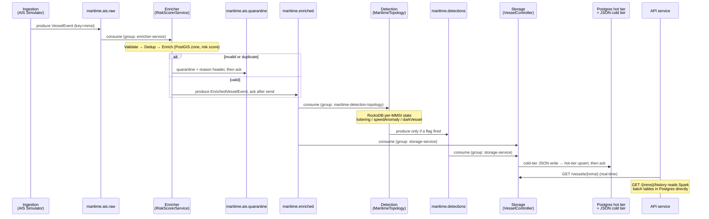

# Maritime Intelligence Platform - Learning Project

This project simulates a simplified version of the Maritime Intelligence Platform described in the job description. It demonstrates the core architecture using Java, Spring Boot, Kafka, and Postgres — and runs entirely on localhost with no cloud dependency.

## What This Project Focuses On

This is a **senior-level backend work sample**, not a tutorial. Its focus is showing *how* a production maritime data pipeline is engineered, with the rationale behind each choice. Concretely, it is focused on:

-   **Real-time streaming pipelines** — an end-to-end Kafka pipeline (ingest → enrich → detect → store → serve) with explicit topics, consumer groups, and partitioning by vessel.
-   **Stateful stream processing** — per-vessel behavioral detection (loitering, speed anomaly, dark vessel) on fault-tolerant Kafka Streams state, in its own dedicated service, distinct from the stateless ETL path.
-   **Data integrity & quality** — schema-on-write with Avro + Schema Registry, validation with a quarantine path, consumer-side deduplication, and at-least-once delivery with dead-letter handling.
-   **The maritime domain** — geospatial enrichment against real PostGIS geofences (restricted / port / EEZ zones), risk scoring, and AIS-specific signals.
-   **Lambda architecture** — a real-time *speed layer* (Kafka Streams) and an exact *batch layer* (Spark over a JSON cold tier), merged behind one *serving layer* (the API service).
-   **Tiered storage** — a Postgres hot tier for low-latency queries and a partitioned JSON cold tier for batch analytics, decoupled behind swappable ports.
-   **Operability** — observability (Micrometer + Prometheus + Grafana), correlation-ID tracing across async hops, structured logging, and CI.
-   **Design rationale** — every significant decision (plain Kafka vs. Kafka Streams, module boundaries, separate detections topic, ack-after-side-effect, schema evolution) is documented with the *why*, not just the *what*.

> **Non-goals:** this is a localhost learning/portfolio build — it does **not** target cloud deployment, authentication/authorization, horizontal-scale tuning, or a production AIS feed. Those are deliberately out of scope so the focus stays on the data-pipeline engineering above.

## Architecture Overview

1.  **Ingestion Service**: Simulates a nine-vessel AIS fleet and pushes events to `maritime.ais.raw`. The fleet is defined in `SimulatedVessel` — adding a vessel requires editing one enum.
2.  **Enricher Service**: Consumes raw vessel events, validates, deduplicates, enriches with geospatial data, and calculates a risk score. Publishes to `maritime.enriched`. Stateless — no Kafka Streams dependency.
3.  **Detection Service**: Consumes `maritime.enriched` under its own consumer group and runs a stateful Kafka Streams topology for per-vessel behavioural detection (loitering, speed anomaly, dark vessel). Publishes flagged events to `maritime.detections`. No Postgres dependency — state lives in RocksDB.
4.  **Storage Service**: Consumes both `maritime.enriched` and `maritime.detections`, saves hot data (latest state per vessel) to Postgres and cold data to a partitioned JSON archive on the local filesystem. Provides a REST API to query vessel state.
5.  **API Service**: Aggregates data from the Storage Service and Spark batch tables, and provides a unified API endpoint for frontend consumption.
6.  **Frontend**: A React SPA served by nginx inside a Docker container. Polls all nine vessels every 2 seconds, renders a live nautical map with colour-coded markers, animated trajectory trails, and a vessel detail panel.

## Modules

The project is a Maven multi-module build with **seven modules** — five runnable Spring Boot services, one shared library, and one standalone Spark application — plus a React frontend.

| Module | Type | Port | Responsibility |
|---|---|---|---|
| `maritime-common` | Library (shared) | — | Avro DTOs, Topics constants, GeoUtils, observability plumbing — the only dependency shared across all modules. |
| `maritime-ingestion` | Spring Boot service | 8081 | AIS simulator — nine-vessel fleet (`SimulatedVessel` enum) with smooth waypoint interpolation. |
| `maritime-enricher` | Spring Boot service | 8082 | Stateless ETL: validate → dedup → PostGIS enrich → risk score → publish to `maritime.enriched`. Owns all Flyway migrations. |
| `maritime-detection` | Spring Boot service | 8086 | Stateful Kafka Streams topology: loitering, speed anomaly, dark vessel. No Postgres. |
| `maritime-storage` | Spring Boot service | 8083 | Tiered persistence (Postgres hot tier + filesystem JSON cold tier) + real-time query API. |
| `maritime-api` | Spring Boot service | 8084 | Public-facing serving layer — merges speed-layer and batch-layer views. |
| `maritime-spark` | Standalone Spark app | — | Batch analytics over the cold JSON tier (`spark-submit` or `mvn exec:java`). |
| `maritime-frontend` | React + Vite SPA | 5173 | Live nautical map, vessel trajectory trails, detail panel, 90-day history chart. |

### `maritime-common` — shared library
The single dependency every module pulls in. Holds the **Avro-generated DTOs** (`VesselEvent`, `EnrichedVesselEvent`) so all services share one schema; **`Topics` constants** (single source of truth for every Kafka topic name); **validation** (`VesselEventValidator`); **geospatial math** (`GeoUtils` — Haversine + JTS point-in-polygon); and **observability plumbing** (`CorrelationIds`, HTTP filter / Kafka interceptors). Has no `main` — it is a JAR, not a service.

### `maritime-ingestion` (8081) — event source
The start of the pipeline. The vessel fleet is defined entirely in `SimulatedVessel`, an enum where each constant holds the vessel's MMSI, display label, speed, and waypoint track. `AisSimulatorController` iterates `SimulatedVessel.values()` every 2 seconds — adding a vessel requires only a new enum constant.

**Fleet (9 vessels):**

| MMSI | Label | Behaviour | Detector target |
|---|---|---|---|
| 123456789 | Normal Transit | Steady eastbound track across the Gulf | — |
| 234567890 | Loiterer | Smooth circular drift at 0.3 kn | Loitering |
| 345678901 | Dark Vessel | Transits, then goes silent after 12 reports | Dark vessel |
| 456789012 | Speed Anomaly | Reports 2 kn but jumps ~24 nm per tick | Speed anomaly |
| 111111111 | Tanker Alpha | Southbound Texas → Yucatan | — |
| 222222222 | Tanker Bravo | Westbound Florida → Texas | — |
| 333333333 | Cargo Alpha | Northbound Cuba → New Orleans | — |
| 444444444 | Cargo Bravo | Deep-gulf east-to-west transit | — |
| 555555555 | Fishing Vessel | Slow meander near Louisiana coast | — |

Waypoint vessels are linearly interpolated between waypoints over `ticksPerWaypoint` ticks, producing smooth continuous movement. Heading is computed as the true bearing to the next waypoint, so markers rotate naturally on turns. Exposes `POST /api/v1/simulate/start|stop`.

### `maritime-enricher` (8082) — stateless ETL
Purely stateless — no Kafka Streams, no RocksDB. `RiskScorerService` (`@KafkaListener` + `KafkaTemplate`) runs the full ETL pipeline: validate → dedup → PostGIS zone enrichment → risk score → publish to `maritime.enriched`. Bad/duplicate events go to `maritime.ais.quarantine` with a `reason` header. Also owns the shared database's Flyway migrations (zones catalog + Spark output tables). Uses `spring.flyway.baseline-on-migrate=true` so it can run against a database that was pre-seeded without Flyway.

### `maritime-detection` (8086) — stateful detection
The Kafka Streams service. `MaritimeTopology` consumes `maritime.enriched` under the dedicated consumer group `maritime-detection-topology` and maintains per-MMSI state in a RocksDB-backed store, fault-tolerant via its changelog topic. `VesselDetectionProcessor` runs three detectors:
-   *Loitering* — sustained low-speed dwell.
-   *Speed anomaly* — Haversine-implied speed vs. reported SOG divergence.
-   *Dark vessel* — wall-clock punctuator scanning for AIS reporting gaps.

Flagged events are published to `maritime.detections`. No Postgres dependency — all state is in RocksDB. `DetectionTopicConfig` owns the `maritime.detections` topic declaration and the Streams changelog topic.

### `maritime-storage` (8083) — persistence + query
Consumes `maritime.enriched` **and** `maritime.detections`. Writes each event to:

-   **Hot tier** (`PostgresVesselStateHotStore`) — `INSERT … ON CONFLICT (mmsi) DO UPDATE` upsert into `vessel_risk`. The flat columns (`risk_level`, `loitering`, …) are queryable; a canonical Avro-JSON `payload` column makes the GET endpoint a byte-for-byte round-trip.
-   **Cold tier** (`FileSystemJsonColdTier`) — one JSON file per event under a Hive-style partition layout: `vessel-events/date=<yyyy-MM-dd>/mmsi=<mmsi>/<epochMs>.json`. Spark reads this with `spark.read().format("json")` and discovers `date` / `mmsi` as virtual partition columns, so no metastore is needed. JSON was chosen over Parquet to eliminate the Hadoop/AWS SDK transitive dependency from the Spring Boot process — an important operational simplification for a local stack.

Both tiers sit behind `VesselStateHotStore` / `ColdTierWriter` ports, so the backing store is swappable. Serves `GET /api/v1/vessels/{mmsi}` (returns 404 when no data exists, never 500).

### `maritime-api` (8084) — serving layer
The public API. Proxies real-time state from the storage service (`GET /api/v1/intelligence/{mmsi}`) and reads the Spark batch tables in Postgres directly for history (`/{mmsi}/history`). `RestTemplate` calls to the storage service are wrapped in a `HttpClientErrorException.NotFound` catch so a vessel with no data yet returns 404 rather than propagating a 500. It is the Lambda-architecture *serving layer* that merges the speed-layer and batch-layer views behind one contract.

### `maritime-spark` — batch layer
A standalone Spark application (not a Spring service), deliberately isolated so its heavy dependency tree never collides with the services' classpaths. Three jobs read the cold JSON tier and write rollups to Postgres, run via `spark-submit` or `mvn exec:java -Plocal`:

-   **`DailyVesselAggregatesJob`** — per-vessel daily event counts, avg/max speed, avg risk, detection-flag counts → `vessel_daily_stats`.
-   **`RiskRollupJob`** — p50/p95 risk percentiles per vessel per day → `vessel_risk_percentiles`.
-   **`LoiteringHotspotJob`** — top-N loitering grid cells → `loitering_hotspots` (PostGIS GiST-indexed).

### `maritime-frontend` — live nautical map

A React 18 + Vite 5 SPA. In production it is built into a static bundle and served by nginx inside a Docker container (`maritime-frontend` service in `docker-compose.yml`). In development it runs on the Vite dev server with a built-in proxy.

**Tech stack:**
- **react-leaflet 4** + **leaflet 1.9** — vessel markers on OpenStreetMap tiles, no API key required.
- **TanStack Query v5** — `useQueries` polls all nine vessels in parallel every 2 seconds.
- **Recharts 2** — `ComposedChart` with dual Y-axes for the 90-day history panel.
- **Tailwind CSS v4** (CSS-first, no config file) + hand-written CVA-based component primitives (Badge, Button, Card).

**How it works:**

1. **Polling** — `useFleet.js` issues `GET /api/v1/intelligence/{mmsi}` for each vessel every 2 seconds using `useQueries`. `retry: false` prevents hammering the API when the dark vessel returns 404 after going silent. The API response is the full `EnrichedVesselEvent` JSON.

2. **Trajectory trails** — `App.jsx` accumulates position history in a `useRef` map (no re-render on every append). On each poll cycle, if a vessel's position changed since the last reading, `{lat, lon}` is pushed onto its track list (capped at 60 points ≈ 2 minutes of history). `VesselMap.jsx` renders a `<Polyline>` per vessel beneath the markers. The selected vessel's trail is thicker and more opaque. Dark vessels get a dashed trail.

3. **Marker colours** — risk-level-coded: green (LOW) / amber (MEDIUM) / red (HIGH). Dark vessels override this with near-black (`#111827`) regardless of risk level, so they remain visible even after going silent. Triangle icons rotate to match the vessel's reported heading.

4. **Detail panel** — clicking a marker opens a side panel with MMSI, risk badge, detection flags (Loitering / Dark Vessel / Speed Anomaly), speed, zone, and distance to port. Below the panel is the `HistoryChart` — a Recharts `ComposedChart` showing daily event count (bar) and avg/p95 risk scores (lines) for up to 90 days. This is populated once Spark jobs have run.

5. **Simulator controls** — **Start** / **Stop** buttons in the header call `POST /api/v1/simulate/start|stop`. A pulsing green dot appears while the simulation is running.

**Proxy configuration** (avoids CORS without touching the backend):

| Path | Dev (Vite) | Production (nginx) |
|---|---|---|
| `/api/v1/simulate/*` | → `localhost:8081` | → `host.docker.internal:8081` |
| `/api/v1/*` | → `localhost:8084` | → `host.docker.internal:8084` |

The `host.docker.internal` pattern (with `extra_hosts: host.docker.internal:host-gateway` in `docker-compose.yml`) lets nginx inside the container reach the Spring Boot services running on the host — the same pattern used by Prometheus in the stack.

---

## Implemented Features

### Ingestion & simulation
-   **AIS simulator** (`AisSimulatorController` + `SimulatedVessel`) drives a nine-vessel demo fleet on a 2-second scheduler. Five vessels are active transits; four exercise specific detectors (loiterer, dark vessel, speed anomaly, normal baseline). Vessel definitions live in `SimulatedVessel` — adding a vessel is one enum constant.
-   Waypoint vessels are smoothly interpolated between positions; heading is the true bearing to the next waypoint.
-   Loiterer uses a deterministic sin/cos circular drift — visually smooth and reproducible, unlike `Math.random()`.
-   Start/stop via `POST /api/v1/simulate/start` and `/stop`.

### Enrichment & risk scoring (`maritime-enricher`)
-   **ETL pipeline** (`RiskScorerService`): Validate → Dedup → Enrich → Score, consuming `maritime.ais.raw` and producing `maritime.enriched`.
-   **Validation** (`VesselEventValidator`): MMSI format (9 digits), lat/lon bounds, null-island `(0,0)` rejection, timestamp staleness, and a speed ceiling. Bad records are routed to `maritime.ais.quarantine` with a reason header.
-   **Deduplication** (`DedupService`): Caffeine-backed, keyed on `(mmsi, timestamp)` with TTL expiry — the consumer-side idempotency that at-least-once delivery requires.
-   **Geospatial enrichment** (`ZoneRepository`): PostGIS `ST_Contains` lookup against a zones catalog (RESTRICTED / PORT / EEZ) with a GiST index.
-   **Risk scoring**: additive model over zone type, near-port proximity, and speed, mapped to LOW / MEDIUM / HIGH.

### Stateful behavioural detection — speed layer (`maritime-detection`)
-   **Kafka Streams topology** (`MaritimeTopology`) with per-MMSI state in a RocksDB-backed store (fault-tolerant via changelog), running in its own Spring Boot service. Three detectors in `VesselDetectionProcessor`:
    -   *Loitering* — sustained low-speed dwell.
    -   *Speed anomaly* — Haversine-implied speed vs. reported SOG divergence.
    -   *Dark vessel* — wall-clock punctuator scanning for reporting gaps (silence).
-   Detections are emitted to a dedicated `maritime.detections` topic (never fed back into the input), keeping the data flow a strict DAG.

### Tiered storage
-   **Hot tier** (`PostgresVesselStateHotStore`): latest state per vessel, `INSERT … ON CONFLICT (mmsi) DO UPDATE` upsert, with a canonical Avro-JSON `payload` column plus flat queryable columns.
-   **Cold tier** (`FileSystemJsonColdTier`): one JSON file per event under a Hive-style `date=/mmsi=` partition layout. Spark reads it with `format("json")` and discovers partition columns automatically — no Hadoop or AWS SDK dependency in the Spring Boot process.
-   Both sit behind `VesselStateHotStore` / `ColdTierWriter` ports, so the backing store is swappable. The storage service consumes both `maritime.enriched` and `maritime.detections`, acking only after both tier writes succeed.

### Batch analytics — batch layer (`maritime-spark`)
-   **`DailyVesselAggregatesJob`**: per-vessel daily event counts, avg/max speed, avg risk, and detection-flag counts → `vessel_daily_stats`.
-   **`RiskRollupJob`**: p50/p95 risk percentiles per vessel per day → `vessel_risk_percentiles`.
-   **`LoiteringHotspotJob`**: top-N loitering grid cells → `loitering_hotspots` (PostGIS GiST-indexed).
-   Jobs read the cold JSON tier via a shared `SparkSessionFactory` / `JobConfig`, writing idempotently to PostGIS.

### Serving layer (`maritime-api`)
-   `GET /api/v1/intelligence/{mmsi}` — latest real-time enriched state (speed layer, via the storage hot tier). Returns 404 when no data exists yet.
-   `GET /api/v1/intelligence/{mmsi}/history` — Spark-computed daily history merging `vessel_daily_stats` + `vessel_risk_percentiles` (batch layer), capped at 90 days. Returns 404 when no batch data exists.

### Frontend
-   Live nautical map with nine vessel markers, colour-coded by risk level (green/amber/red/black).
-   Animated trajectory trails — client-side position accumulation (last 60 positions per vessel, ~2 min), rendered as `<Polyline>` with per-vessel colour. Selected vessel trail is highlighted.
-   Vessel detail panel with MMSI, risk badge, detection flags, speed, and zone.
-   90-day history chart (Recharts) — populated once Spark batch jobs have run.
-   Start/Stop simulation buttons.
-   Deployed as a Docker container; also runnable on the Vite dev server.

### Data contracts
-   **Avro + Confluent Schema Registry** for all Kafka payloads (`VesselEvent`, `EnrichedVesselEvent`), with backward-compatible field evolution (union-with-`null`, defaulted detection flags).

### Observability
-   **Micrometer + Prometheus + Grafana**: per-detection counters and latency timers scraped from all five services; a provisioned Grafana dashboard.
-   **Correlation IDs** propagated across async hops via Kafka headers and HTTP, bound to the logging MDC for end-to-end tracing of a single event across all services.

### Testing & build
-   **Unit tests** for validation, geo math, and dedup (including a 20-thread race test).
-   **Integration tests** via Testcontainers: the enricher pipeline (real Kafka + Schema Registry), storage (real Postgres), and detection topology; Spark jobs tested against an H2 in-memory DB.
-   **CI** (`./mvnw verify` on JDK 17), a `Makefile` for common workflows, and `docker-compose` for the full local stack.

---

## Event Flow — the life of a vessel event

A single AIS report travels through five services and up to four Kafka topics. Every Kafka payload is Avro, keyed by `mmsi` (so a vessel's events stay ordered on one partition). Each consumer commits its offset **only after** its side effect succeeds (ack-after-side-effect, at-least-once).

### Topics & consumer groups

| Topic | Produced by | Consumed by (group) | Payload |
|---|---|---|---|
| `maritime.ais.raw` | Ingestion (`AisSimulatorController`) | Enricher `RiskScorerService` (`enricher-service`) | `VesselEvent` |
| `maritime.enriched` | Enricher `RiskScorerService` | Detection `MaritimeTopology` (`maritime-detection-topology`) **and** Storage `VesselController` (`storage-service`) | `EnrichedVesselEvent` |
| `maritime.detections` | Detection `MaritimeTopology` | Storage `VesselController` (`storage-service`) | `EnrichedVesselEvent` (≥1 flag set) |
| `maritime.ais.quarantine` | Enricher `RiskScorerService` | (audit sink) | `VesselEvent` + `reason` header |
| `maritime.ais.raw.DLT` / `maritime.enriched.DLT` | `DefaultErrorHandler` after retries exhausted | (dead-letter sink) | original record |

> **Two independent consumers of `maritime.enriched`.** The detection service and the storage service each subscribe to `maritime.enriched` under their own consumer groups and receive the full stream independently. The detection topology re-publishes only *flagged* events to the separate `maritime.detections` topic — it never writes back to `maritime.enriched`, which keeps the flow a strict DAG (no feedback loop).

### Sequence



### Step by step

1. **Ingest** — the simulator emits a `VesselEvent` to `maritime.ais.raw`, keyed by MMSI, stamping a correlation ID into the MDC and Kafka headers.
2. **Validate & dedup** — `RiskScorerService` (`enricher-service` group) validates the event and checks the Caffeine dedup cache. Invalid or duplicate events go to `maritime.ais.quarantine`; the offset is acked only after the quarantine send confirms.
3. **Enrich & score** — valid events get a PostGIS zone lookup and a risk score, are wrapped as an `EnrichedVesselEvent` (detection flags default `false`), and published to `maritime.enriched`. Offset acked only after the produce callback succeeds.
4. **Detect (speed layer)** — `MaritimeTopology` in `maritime-detection` (`maritime-detection-topology` group) consumes `maritime.enriched`, updates per-MMSI RocksDB state, and runs the loitering / speed-anomaly / dark-vessel detectors. Events where a flag fires are re-published to `maritime.detections`; clean events produce no output.
5. **Persist** — `VesselController` (`storage-service` group) subscribes to **both** `maritime.enriched` and `maritime.detections`. Each event is written to the JSON cold tier and upserted into the Postgres hot tier, then acked.
6. **Serve** — the API service exposes `GET /api/v1/intelligence/{mmsi}` (real-time, proxied from the storage hot tier) and `/{mmsi}/history` (Spark batch rollups read straight from Postgres).
7. **Failure path** — if a consumer throws, `DefaultErrorHandler` retries (fixed backoff, 3 attempts); exhausted records land in `<topic>.DLT` instead of blocking the partition.

---

## Prerequisites

-   Java 17+
-   Maven 3.8+ (or use the included `./mvnw` wrapper)
-   Docker & Docker Compose

## How to Run

### 1. Start infrastructure
```bash
make up
# or: docker compose up -d
```
Starts Kafka, Zookeeper, Schema Registry, PostGIS, Prometheus (:9090), Grafana (:3000), and the frontend container (:5173).

### 2. Build all modules
```bash
make build
# or: ./mvnw clean install -DskipTests
```

### 3. Run the five Spring Boot services

Each service needs its own terminal (or use `make run-all` to start all five in the background):

```bash
make run-ingestion   # :8081
make run-enricher    # :8082
make run-detection   # :8086
make run-storage     # :8083
make run-api         # :8084
```

Or start all five in the background with logs going to `/tmp/*.log`:
```bash
make run-all
```

To stop individual services safely (by port — won't accidentally kill siblings):
```bash
make stop-ingestion   # kills :8081 only
make stop-all         # kills all five
```

> **Start order matters for topic creation.** The enricher declares the platform's input topics and should start before the detection and storage services. The detection service declares `maritime.detections` and the Streams changelog topic.

### 4. Start the simulation
```bash
curl -X POST http://localhost:8081/api/v1/simulate/start
# or click "Start Simulation" in the frontend
```

All nine vessels begin emitting. Within ~4 seconds you should see markers appear on the map and vessel data flowing through the pipeline logs.

### 5. Open the frontend

The frontend is already running as a Docker container (started in step 1):
```
http://localhost:5173
```

For development with hot reload:
```bash
cd maritime-frontend
npm install      # first time only
npm run dev
# → http://localhost:5173
```

The Vite dev server proxies API calls automatically — no CORS configuration needed. The Docker container uses nginx with equivalent proxy rules pointing at `host.docker.internal`.

### 6. Query the API directly
```bash
# Latest vessel state (speed layer)
curl http://localhost:8084/api/v1/intelligence/123456789

# 90-day history (batch layer — empty until Spark jobs run)
curl http://localhost:8084/api/v1/intelligence/123456789/history
```

### 7. Stop the simulation
```bash
curl -X POST http://localhost:8081/api/v1/simulate/stop
```

Vessel positions freeze; the hot tier retains the last known state. The dark vessel marker remains on the map (coloured black) showing its last known position.

### 8. Run Spark batch jobs (optional)
```bash
make spark-daily    # DailyVesselAggregatesJob
make spark-risk     # RiskRollupJob
make spark-hotspot  # LoiteringHotspotJob
```
After the jobs run, the history chart in the frontend panel will populate with daily aggregates and risk percentiles.

---

## Key Concepts Demonstrated

-   **Maven Multi-Module Project**: Shared code in `maritime-common`; each service has exactly the dependencies it needs.
-   **Microservice boundary by statefulness**: stateless ETL (`maritime-enricher`) and stateful stream processing (`maritime-detection`) are separate deployable units.
-   **Kafka Streaming**: Producer/Consumer pattern with topic partitioning; Kafka Streams for stateful processing.
-   **Geospatial Processing**: Point-in-polygon checks using JTS + PostGIS.
-   **Tiered Storage**: Postgres hot tier + local JSON cold tier, decoupled behind storage-port interfaces.
-   **Lambda Architecture**: speed layer (Kafka Streams) + batch layer (Spark) + serving layer (API), all over the same data.
-   **Frontend real-time visualisation**: polling-based live map, client-side trajectory accumulation, risk-coded markers.

---

## Key Engineering Decisions

The platform follows a **Lambda architecture**: a real-time *speed layer* (Kafka Streams in `maritime-detection`), a *batch layer* (Spark jobs computing exact daily aggregates and percentiles), and a *serving layer* (the API service merging both views). The decisions below are the ones that most shape the design.

1.  **Stateful detection as a separate service.** The Kafka Streams topology (`MaritimeTopology`) lives in `maritime-detection`, not in `maritime-enricher`. This is a deliberate separation of concerns: the enricher is purely stateless (validate, enrich, score) while the detection service is stateful (RocksDB, changelog, punctuator). The two have different scaling requirements, different failure modes, and different operational concerns — separating them lets each be reasoned about, deployed, and scaled independently.

2.  **No cross-module dependency between enricher and detection.** `maritime-detection` does not depend on `maritime-enricher`. Both depend only on `maritime-common`. They communicate exclusively through Kafka topics (`maritime.enriched` → `maritime.detections`), making the data flow the contract rather than a Java API.

3.  **Stateful detection backed by RocksDB.** The Kafka Streams topology keeps full per-MMSI state in a RocksDB-backed key/value store that survives restarts via its changelog topic. Three behavioral detectors run on this state:
    -   *Loitering* — low-speed dwell duration.
    -   *Speed anomaly* — Haversine-implied speed vs. reported SOG.
    -   *Dark vessel* — a wall-clock punctuator that scans for reporting gaps (silence). This is the correct pattern: the absence of messages cannot be detected from the stream itself, so a scheduled scan is required.

4.  **Detections emit to a separate topic.** Detection results are written to `maritime.detections` and never fed back into `maritime.enriched`. This structurally prevents processing loops and keeps the topology a clean DAG.

5.  **JSON over Parquet for the cold tier.** The cold tier writes one JSON file per event (via `FileSystemJsonColdTier`) rather than Parquet. This eliminates the `hadoop-common` and `parquet-avro` dependencies from the Spring Boot process — those libraries transitively pull in the AWS SDK, which caused `SdkClientException` in the hot-tier query path even on purely local storage. Spark reads the JSON tier natively with `format("json")` and discovers the Hive-style `date=/mmsi=` partition columns automatically, so no metastore is required and no Spark-side changes were needed beyond swapping `"parquet"` for `"json"`.

6.  **Serde / Schema Registry lifecycle management.** Avro Serdes (and their `SchemaRegistryClient`) are held as fields and closed in `@PreDestroy`, rather than created per topology build. This avoids leaking HTTP connection pools on every restart.

7.  **At-least-once semantics done correctly.** Kafka offsets are committed only *after* the downstream produce callback succeeds — never optimistically before the side effect — so no event is silently dropped on failure.

8.  **Port/adapter (hexagonal) design.** Storage and lookup concerns sit behind interfaces (`VesselStateHotStore`, `ColdTierWriter`, `PortDistanceProvider`) so backing implementations are swappable without touching callers.

9.  **Backward-compatible schema evolution.** Avro schemas use union-with-`null` fields and default detection flags to `false`, so new and old readers/writers remain compatible as the schema grows.

10. **Observability and traceability built in.** Micrometer counters track each detection type across all five services, and correlation IDs propagate across async hops (Kafka headers + HTTP) via MDC, making a single event traceable end-to-end.

11. **Frontend trajectory without backend changes.** Live vessel trails are accumulated purely on the client: each `useFleet` poll appends the new position to a per-vessel `useRef` map if it changed, capped at 60 points. This provides ~2 minutes of live history with no new API endpoints, no database table, and no extra network calls — the right trade-off for a portfolio demo where Spark already owns the historical record.

---

## Design Rationale — Plain Kafka vs. Kafka Streams, and Why They Live in Separate Modules

The platform uses **both** the plain Spring Kafka consumer/producer API and the native Kafka Streams client. The split follows a single rule:

> **Use plain Kafka when each message can be processed on its own. Use Kafka Streams the moment correctness depends on *other* messages — previous state, time windows, joins, or aggregations.**

And the module boundary follows directly from that:

> **Stateless work belongs in `maritime-enricher`. Stateful work belongs in `maritime-detection`.**

| | Plain Kafka — `maritime-enricher` | Kafka Streams — `maritime-detection` |
|---|---|---|
| Nature | **Stateless** — one event in, one event out | **Stateful** — needs the vessel's history |
| API | `@KafkaListener` + `KafkaTemplate` | `StreamsBuilder` topology |
| State | None | RocksDB `KeyValueStore`, one `VesselState` per MMSI |
| Postgres | Yes (PostGIS zone lookup, Flyway migrations) | No |
| Example work | Validate, dedup, enrich, score | Loitering, speed-anomaly, dark-vessel detection |
| Deployment concern | Stateless — scale freely | Stateful — partition assignment must be respected |

**Why `RiskScorerService` stays plain and in `maritime-enricher`.** Validation, zone enrichment, and scoring depend only on the event in hand. A plain consumer/producer is the simpler, lighter tool — no state stores, no topology, less to reason about. Kafka Streams here would add complexity that buys nothing.

**Why `MaritimeTopology` needs Streams and its own module.** Detecting that a vessel is *loitering* or *dark* requires comparing the current report against its past. Streams provides, out of the box, what you'd otherwise hand-build on top of a plain consumer:

1.  **Durable, partitioned state.** A per-MMSI store backed by a **changelog topic** — on restart it replays the changelog and resumes exactly where it left off. No external Redis/Postgres and no per-event network hop.
2.  **State co-partitioned with the data.** Streams guarantees a key's events and that key's state live on the same task, so a vessel's full history is always in one place. A plain consumer spreading events across instances would silently see only fragments.
3.  **Time and the punctuator.** The dark-vessel detector fires when events *stop* arriving. Streams' wall-clock `context.schedule(...)` punctuator scans the store on a timer; plain Kafka would need a separately managed scheduler coordinated with an external store.
4.  **Rebalance & fault tolerance.** When an instance dies, Streams migrates the affected state (restored from the changelog) to the new owner. Doing this safely by hand is genuinely hard.

**The cost (why not Streams everywhere).** Kafka Streams pins you to the JVM, adds RocksDB on local disk plus internal changelog/repartition topics, and makes the app stateful — deployment and scaling must respect partition assignment. For a stateless step like `RiskScorerService`, that overhead is pure cost with no benefit. Separating the modules makes that cost boundary explicit and enforced at compile time.
